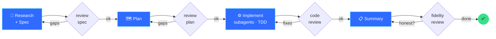
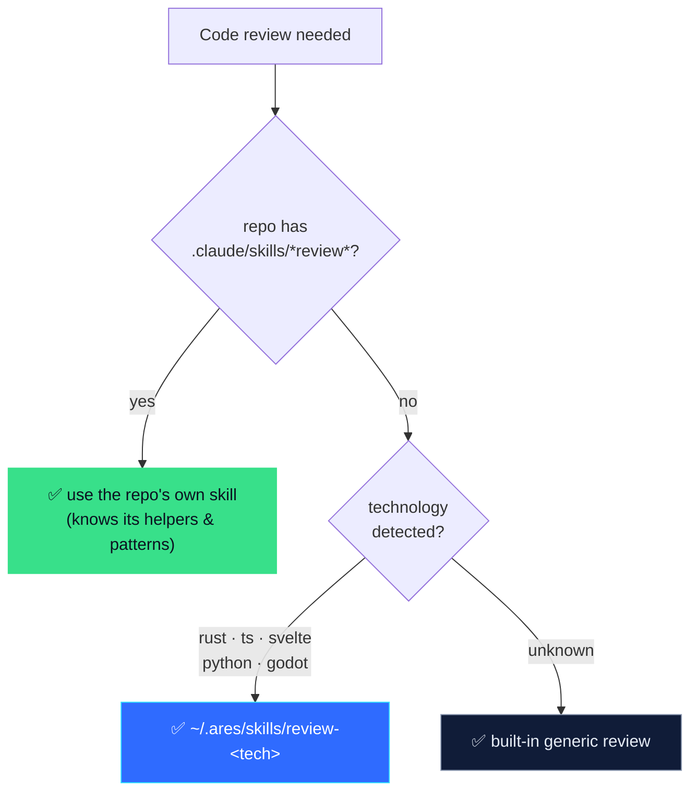

<div align="center">


# Ares

### *Programa. Recuerda. No miente.*

**A personal AI software engineer with a soul.** Built on the [Claude Agent SDK](https://code.claude.com/docs/en/agent-sdk/typescript), Ares brings the discipline of a senior engineer to your terminal and your phone — it writes tests first, reviews its own code, remembers your projects, and tells you the truth when something breaks.

</div>

---

## What is Ares?

Ares is not a chatbot wrapper. It's an autonomous coding agent given a **persistent identity and an engineering doctrine** — the habits that separate a competent developer from a world-class one, encoded so the model can't shortcut them:

- It **searches before it creates**, **reproduces before it theorizes**, and **verifies before it claims** anything works.
- It follows a **disciplined workflow** — spec → review → plan → review → implementation → review → summary → review — on any non-trivial task.
- It **disagrees with you** when the evidence says you're wrong, instead of telling you what you want to hear.
- It **remembers** — who you are, your preferences, and the architecture gotchas of every repo it touches.

The same brain, memory, and doctrine drive two surfaces: a polished **terminal CLI** and a **Telegram bot** you can drive from your pocket.

---

## Highlights

| | |
|---|---|
| 🧠 **A written soul** | Identity + a 13-point engineering doctrine + working protocols (TDD, systematic debugging, verify-before-claim, disciplined workflow). Not prompt fluff — enforced via runtime hooks. |
| 🔬 **Structural code eyes** | When a repo is indexed with [CodeGraph](https://github.com/), Ares connects its MCP and reasons over a real AST — "who calls this", "what breaks if I change that" — instead of grepping blind. |
| 🧪 **Tests first** | New logic starts with a failing test; bugs start with a reproducing test. The test is the executable spec. |
| 🔁 **Per-project code review** | At review time Ares auto-selects the right review protocol: the repo's own `.claude/skills/*review*` if present, else a technology-matched one (Rust, TypeScript, Svelte, Python, Godot), else a generic pass. |
| 💾 **Cross-session memory** | One fact per file in `~/.ares/memory/`, plus per-repo architecture notes in `<repo>/.ares/NOTES.md`, loaded automatically so Ares starts every session knowing the terrain. |
| ⚡ **Two surfaces, one core** | Interactive Ink TUI with live task lists and visible reasoning, a headless `ares -p` mode for scripts and cron, and a Telegram bridge — all consuming the same agent core. |
| 🛡️ **Safety by design** | Allowlisted Telegram access, opt-in command confirmations (`--safe`), and a character that treats its own work as the most suspicious in the room. |

---

## The disciplined workflow

On any non-trivial task, Ares doesn't jump to code. It moves through gated phases — each one reviewed before the next — so quality is structural, not a matter of luck:



The code-review phase picks its protocol automatically:



---

## How it works

Ares is built in three layers with one rule: **only `core/` ever touches the Agent SDK.** The channels just render its normalized event stream.


- **`core/agent.ts`** — the single gateway to the SDK's `query()`. Composes the system prompt (soul + memory + project notes), wires the in-process toolbelt and (when available) the CodeGraph MCP, runs adaptive thinking, and translates the raw stream into channel-agnostic events (`status` · `delta` · `thinking` · `todos` · `result`).
- **`core/soul/`** — `soul.md` (identity + doctrine) and `protocols/` (debugging, verification, search-first, step-by-step, feedback, disagree, workflow, research-first, tdd, structural-eyes, project-notes, engineering-judgment). Loaded into every session.
- **`core/memory.ts`** — persistent, file-based memory with a one-line index injected at startup.
- **`core/review.ts`** — three-tier discovery of the code-review protocol for the current repo.
- **`core/codegraph.ts`** — detects whether CodeGraph is indexed and attaches its MCP server.
- **`core/toolbelt/`** — in-process MCP tools (`remember`, `screenshot`, `review_skill`); adding one is a single file plus a line in the registry.

---

## Quickstart

Requires **Node.js ≥ 20** and the [`claude`](https://claude.com/claude-code) CLI authenticated with your subscription (or an `ANTHROPIC_API_KEY`).

```bash
git clone https://github.com/MarcArcherCiscar/Ares.git && cd Ares
npm install
npm run build
npm link            # makes `ares` available everywhere
```

### Use it in the terminal

```bash
cd ~/your-project
ares                       # interactive session
ares -p "run the tests"    # headless: execute and exit (scripts, cron, bridges)
ares --safe                # ask for confirmation before each command
ares -m sonnet             # override the model for this run
```

### Use it from Telegram

```bash
cp .env.example .env       # add your bot token + Telegram user id
npm start                  # connects the bot
```

Then message your bot: `/open <project>` and give it a task. See [Configuration](#configuration).

---

## The two surfaces

**Terminal CLI** — an Ink TUI with the Ares banner, streaming responses, a live task checklist, visible reasoning, and clickable links. Runs without permission prompts by default (like `--dangerously-skip-permissions`); `--safe` restores per-command confirmation. The headless `ares -p "<task>"` mode powers scripts, git hooks, cron, and the Telegram bridge.

**Telegram bot** — drive Ares from your phone. Allowlisted to your user id, with per-project persistent conversations, fuzzy zero-config project discovery (`/open dafne-api`), a model picker, cron-scheduled tasks that report back, and Playwright screenshots delivered to the chat.

| Command | What it does |
| --- | --- |
| `/open <name\|path>` | Open a project (Ares finds it in your folders) and switch to its conversation |
| `/find <text>` | Search your local projects |
| `/projects` · `/sessions` | List discovered projects · your per-project conversations |
| `/new` | Fresh conversation for the current project |
| `/status` | Current model, project, and session |
| `/model <opus\|sonnet\|haiku\|id>` | Set the model for this chat |
| `/schedule <m h dom mon dow> <prompt>` | Recurring task; `/schedules`, `/unschedule <id>` to manage |

---

## Configuration

**Models** live in `~/.ares/config.json` — a preference chain tried in order, plus thinking and turn budget:

```json
{ "models": ["claude-fable-5", "claude-opus-4-8"], "maxTurns": 40, "thinking": "adaptive" }
```

Authentication flows through the `claude` binary's subscription session (or `CLAUDE_CODE_OAUTH_TOKEN`); `ANTHROPIC_API_KEY` is an optional fallback.

**Telegram** (`.env`):

| Variable | Purpose |
|---|---|
| `TELEGRAM_BOT_TOKEN` | From [@BotFather](https://t.me/BotFather). |
| `TELEGRAM_ALLOWED_USER_IDS` | Your numeric id (from [@userinfobot](https://t.me/userinfobot)), comma-separated. **Required** — an open bot is remote code execution. |
| `ARES_PROJECTS_ROOTS` | Folders to scan for projects, e.g. `~/Proyectos`. Recommended: scoping the scan is faster and more reliable than searching the whole home directory. |
| `ARES_WORKSPACE_DIR` · `ARES_MAX_TURNS` · `ARES_DATA_DIR` | Fallback workspace · agentic turn cap · state directory. |

---

## Keeping it alive (macOS)

To keep the Telegram bot running while your Mac is locked, run it under
[PM2](https://pm2.keymetrics.io) wrapped in `caffeinate` (config in
`ecosystem.config.cjs`):

```bash
npm i -g pm2
npm run build
pm2 start ecosystem.config.cjs && pm2 save
pm2 startup            # prints a sudo command — run it once for auto-start on boot
```

`caffeinate -is` prevents idle/AC sleep while the bot runs, and PM2 restarts it
on crash and on reboot. Locking the screen keeps processes alive; **closing a
MacBook lid still forces sleep** (leave it open, or run on always-on hardware).
For true 24/7 independent of your laptop, deploy the bot on a server — note it
then works on *that* machine's repos, not your local ones.

## Security

Ares can run shell commands and modify files autonomously — that's the point, and the risk.

- The Telegram channel runs with permissions bypassed (no interactive approval over chat), so **`TELEGRAM_ALLOWED_USER_IDS` is mandatory**.
- The CLI defaults to no-confirmation execution; use `ares --safe` for per-command approval on anything sensitive.
- Run it against repos and branches you're comfortable letting an agent edit; prefer a container or VM for untrusted work.
- The bot reaches Telegram via outbound long-polling — no inbound ports, no webhook to expose.

---

## Tech stack

TypeScript (NodeNext, Node ≥ 20) · [`@anthropic-ai/claude-agent-sdk`](https://code.claude.com/docs/en/agent-sdk/typescript) · [Ink](https://github.com/vadimdemedes/ink) + React (TUI) · [grammY](https://grammy.dev) (Telegram) · [Playwright](https://playwright.dev) (screenshots) · [croner](https://github.com/hexagon/croner) (scheduling) · [Vitest](https://vitest.dev) (tests) · [Zod](https://zod.dev) (schemas).

---

## Identity

The Spartan helmet (Ares Blue on Ink) lives in `assets/` — `ares-helmet.png` (1254×1254), `ares-avatar-640.png` (Telegram avatar), `ares-icon-512.png` (icon). The CLI banner is derived into truecolor ANSI art via `scripts/helmet-to-ansi.mjs`.

Palette — Ares Blue `#2F6BFF` · Spark `#34E0FF` · Sky `#8FB3FF` · Gold `#FFC53D` · Ember `#FF5C5C` · Laurel `#38E08A` · Steel `#8B98B0` · Ink `#0B1220`.

---

<div align="center">
<sub>Built by Marc Archer · powered by the Claude Agent SDK</sub>
</div>
