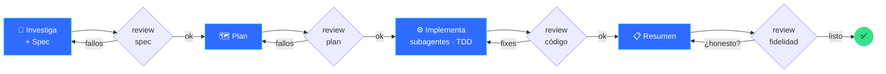
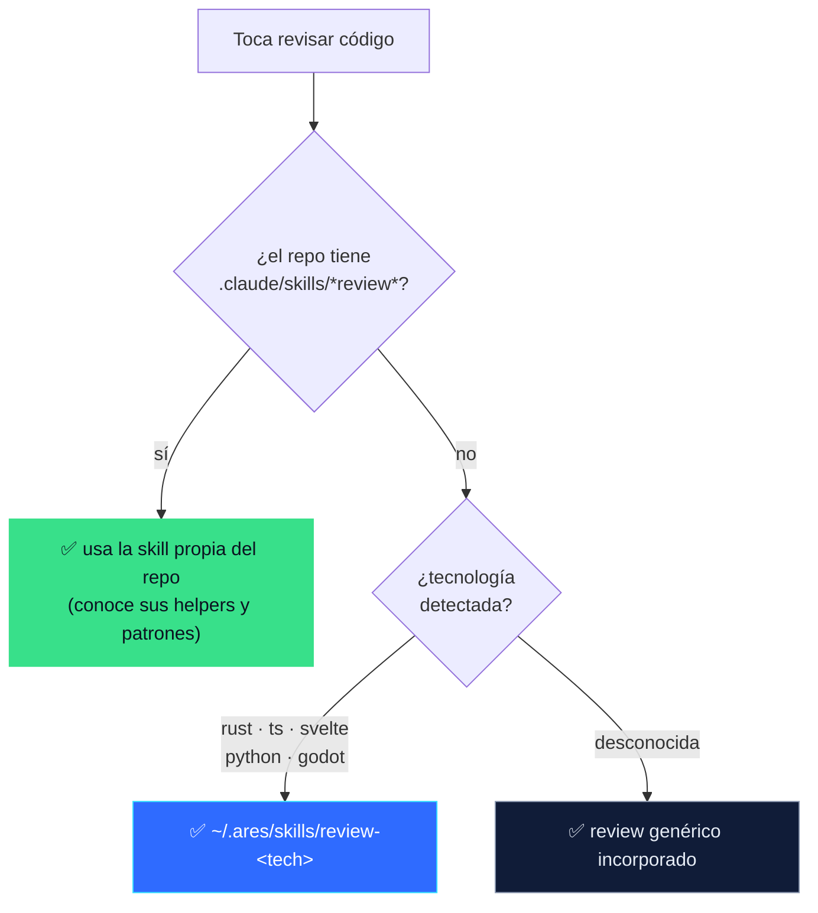
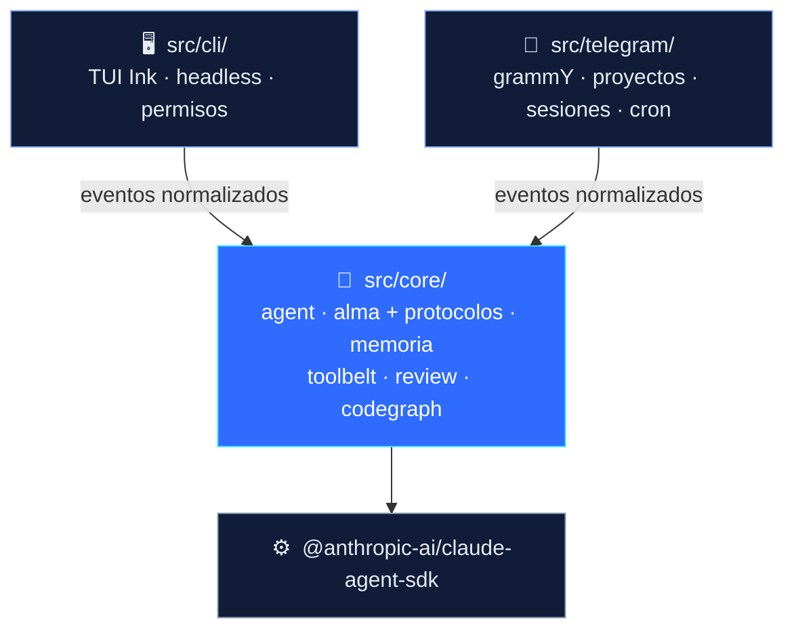

<div align="center">


# Ares

### *Programa. Recuerda. No miente.*

**Un ingeniero de software personal con alma.** Construido sobre el [Claude Agent SDK](https://code.claude.com/docs/en/agent-sdk/typescript), Ares lleva la disciplina de un senior a tu terminal y a tu móvil: escribe los tests primero, revisa su propio código, recuerda tus proyectos y te dice la verdad cuando algo se rompe.

</div>

---

## ¿Qué es Ares?

Ares no es un wrapper de chatbot. Es un agente de programación autónomo con una **identidad persistente y una doctrina de ingeniería** — los hábitos que separan a un dev competente de uno de primer nivel, codificados para que el modelo no pueda saltárselos:

- **Busca antes de crear**, **reproduce antes de teorizar** y **verifica antes de afirmar** que algo funciona.
- Sigue un **flujo disciplinado** — spec → review → plan → review → implementación → review → resumen → review — en cualquier tarea no trivial.
- **Te lleva la contraria** cuando la evidencia dice que te equivocas, en vez de decirte lo que quieres oír.
- **Recuerda**: quién eres, tus preferencias y los campos minados de cada repo que toca.

El mismo cerebro, memoria y doctrina mueven dos canales: una **CLI de terminal** cuidada y un **bot de Telegram** que llevas en el bolsillo.

---

## Lo que lo hace distinto

| | |
|---|---|
| 🧠 **Un alma escrita** | Identidad + doctrina de ingeniería de 14 puntos + protocolos de trabajo (TDD, debugging sistemático, verificar antes de afirmar, flujo disciplinado). No es relleno de prompt: se refuerza con hooks en tiempo de ejecución. |
| 🔬 **Ojos estructurales del código** | Cuando un repo está indexado con [CodeGraph](https://github.com/), Ares conecta su MCP y razona sobre un AST real — "quién llama a esto", "qué rompo si cambio aquello" — en vez de hacer grep a ciegas. |
| 🧪 **Tests primero** | La lógica nueva empieza por un test que falla; los bugs por un test que los reproduce. El test es la especificación ejecutable. |
| 🪒 **Menos código, sin farolear** | Baja una escalera *reutilizar → plataforma → dependencia instalada → mínimo* antes de escribir nada nuevo — y nunca llama a una API, método o flag sin confirmar que existe. El mejor código es el que no escribes. |
| 🕷️ **Scraping de serie** | [Scrapling](https://scrapling.readthedocs.io) es el motor por defecto para extraer de la web (bypass anti-bot, sigilo, spiders). La skill viaja vendorizada; `npm run setup` instala la librería en un `~/.ares/venv` aislado — cero configuración manual. |
| 🔁 **Code review por proyecto** | A la hora de revisar, Ares elige el protocolo correcto: la skill propia del repo (`.claude/skills/*review*`) si existe, si no la de la tecnología detectada (Rust, TypeScript, Svelte, Python, Godot), si no una genérica. |
| 💾 **Memoria entre sesiones** | Un hecho por archivo en `~/.ares/memory/`, más notas de arquitectura por repo en `<repo>/.ares/NOTES.md`, cargadas solas para que Ares arranque conociendo el terreno. Las conversaciones también se retoman (terminal y Telegram). |
| ⚡ **Dos canales, un núcleo** | TUI interactiva con lista de tareas en vivo y razonamiento a la vista, modo headless `ares -p` para scripts y cron, y el puente de Telegram — todo consumiendo el mismo núcleo. |
| 🛡️ **Seguro por diseño** | Acceso a Telegram por lista blanca, confirmación de comandos opcional (`--safe`), y un carácter que trata su propio trabajo como lo más sospechoso de la sala. |

---

## El flujo disciplinado

Ante una tarea no trivial, Ares no salta al código. Avanza por fases con compuertas — cada una revisada antes de la siguiente — para que la calidad sea estructural, no cuestión de suerte:



La fase de code review elige su protocolo automáticamente:



---

## Cómo funciona

Ares está construido en tres capas con una regla: **solo `core/` toca el Agent SDK.** Los canales solo renderizan su stream de eventos normalizado.



- **`core/agent.ts`** — la única puerta al `query()` del SDK. Compone el system prompt (alma + memoria + notas del proyecto), conecta el toolbelt in-process y (si está) el MCP de CodeGraph, corre el thinking adaptativo, y traduce el stream crudo a eventos agnósticos del canal (`status` · `delta` · `thinking` · `todos` · `result`).
- **`core/soul/`** — `soul.md` (identidad + doctrina) y `protocols/` (debugging, verification, search-first, step-by-step, feedback, disagree, workflow, research-first, tdd, structural-eyes, project-notes, engineering-judgment, scraping). Se cargan en cada sesión.
- **`core/memory.ts`** — memoria persistente en archivos, con un índice de una línea inyectado al arrancar.
- **`core/review.ts`** — descubrimiento en 3 niveles del protocolo de code review del repo actual.
- **`core/codegraph.ts`** — detecta si CodeGraph está indexado y engancha su servidor MCP.
- **`core/toolbelt/`** — tools MCP in-process (`remember`, `screenshot`, `review_skill`); añadir una es un archivo más una línea en el registro.

---

## Arranque rápido

Necesita **Node.js ≥ 20** y la CLI [`claude`](https://claude.com/claude-code) autenticada con tu suscripción (o un `ANTHROPIC_API_KEY`).

```bash
git clone https://github.com/MarcArcherCiscar/Ares.git && cd Ares
npm install
npm run build
npm link            # deja `ares` disponible en cualquier sitio
npm run setup       # opcional: instala Scrapling en un ~/.ares/venv aislado
```

`npm run setup` configura las capacidades opcionales de Ares — ahora mismo
[Scrapling](https://scrapling.readthedocs.io), su motor de scraping por defecto.
Crea un virtualenv aislado en `~/.ares/venv` e instala Scrapling ahí (sin
ensuciar el Python del sistema, sin líos de PEP 668). La skill de *cómo usarlo*
viaja vendorizada dentro de Ares, así que el scraping funciona igual en cualquier
máquina que corra el setup — nada que clonar ni cablear a mano.

### En la terminal

```bash
cd ~/tu-proyecto
ares                       # sesión interactiva
ares -p "corre los tests"  # headless: ejecuta y sale (scripts, cron, puentes)
ares -c                    # retoma la última conversación de esta carpeta
ares -r                    # elige qué conversación retomar (selector)
ares --safe                # pide confirmación antes de cada comando
ares -m sonnet             # cambia el modelo para esta sesión
```

### Desde Telegram

```bash
cp .env.example .env       # pon el token del bot + tu user id de Telegram
npm start                  # conecta el bot
```

Luego escríbele a tu bot: `/open <proyecto>` y dale una tarea. Ver [Configuración](#configuración).

---

## Los dos canales

**CLI de terminal** — una TUI Ink con el banner de Ares, respuestas en streaming, markdown renderizado (negritas, código, tablas, enlaces clicables), lista de tareas en vivo y razonamiento a la vista. Por defecto ejecuta sin pedir permiso (como `--dangerously-skip-permissions`); `--safe` reactiva la confirmación por comando. Las conversaciones persisten por carpeta: `ares -c` retoma la última, `ares -r` abre un selector para elegir, y `/sesiones` · `/retomar` · `/nueva` las gestionan a mitad de sesión. El modo headless `ares -p "<tarea>"` alimenta scripts, hooks de git, cron y el puente de Telegram.

**Bot de Telegram** — maneja Ares desde el móvil. Limitado a tu user id, con conversaciones persistentes por proyecto, descubrimiento difuso de proyectos sin configurar (`/open dafne-api`), selector de modelo, tareas programadas con cron que reportan de vuelta, y capturas con Playwright entregadas al chat.

| Comando | Qué hace |
| --- | --- |
| `/open <nombre\|ruta>` | Abre un proyecto (Ares lo busca en tus carpetas) y cambia a su conversación |
| `/find <texto>` | Busca entre tus proyectos locales |
| `/projects` · `/sessions` | Lista proyectos descubiertos · tus conversaciones por proyecto |
| `/historial` | Elige con botones qué conversación previa del proyecto retomar |
| `/new` | Conversación nueva para el proyecto actual |
| `/status` | Modelo, proyecto y sesión actuales |
| `/model <opus\|sonnet\|haiku\|id>` | Fija el modelo de este chat |
| `/schedule <m h dom mon dow> <prompt>` | Tarea recurrente; `/schedules`, `/unschedule <id>` para gestionarlas |

---

## Configuración

**Modelos** en `~/.ares/config.json` — una cadena de preferencia que se prueba en orden, más thinking y límite de turnos:

```json
{ "models": ["claude-fable-5", "claude-opus-4-8"], "maxTurns": 40, "thinking": "adaptive" }
```

La autenticación va por la sesión de suscripción del binario `claude` (o `CLAUDE_CODE_OAUTH_TOKEN`); `ANTHROPIC_API_KEY` es un fallback opcional.

**Telegram** (`.env`):

| Variable | Para qué |
|---|---|
| `TELEGRAM_BOT_TOKEN` | De [@BotFather](https://t.me/BotFather). |
| `TELEGRAM_ALLOWED_USER_IDS` | Tu id numérico (de [@userinfobot](https://t.me/userinfobot)), separado por comas. **Obligatorio** — un bot abierto es ejecución remota de código. |
| `ARES_PROJECTS_ROOTS` | Carpetas donde buscar proyectos, p. ej. `~/Proyectos`. Recomendado: acotar el escaneo es más rápido y fiable que rastrear todo el home. |
| `ARES_WORKSPACE_DIR` · `ARES_MAX_TURNS` · `ARES_DATA_DIR` | Workspace por defecto · límite de turnos · directorio de estado. |

---

## Mantenerlo vivo (macOS)

Para que el bot de Telegram siga corriendo con el Mac bloqueado, lánzalo bajo
[PM2](https://pm2.keymetrics.io) envuelto en `caffeinate` (config en
`ecosystem.config.cjs`):

```bash
npm i -g pm2
npm run build
pm2 start ecosystem.config.cjs && pm2 save
pm2 startup            # imprime un comando con sudo — ejecútalo una vez para auto-arranque
```

`caffeinate -is` evita que el Mac se duerma mientras el bot corre, y PM2 lo
reinicia si crashea y al reiniciar. Bloquear la pantalla mantiene los procesos
vivos; **cerrar la tapa del MacBook fuerza el sleep igualmente** (déjala abierta,
o usa hardware siempre encendido). Para 24/7 de verdad sin depender del portátil,
despliega el bot en un servidor — ojo: ahí trabaja sobre los repos de *esa*
máquina, no los de tu Mac.

## Seguridad

Ares puede ejecutar comandos y modificar archivos de forma autónoma — ese es el objetivo, y el riesgo.

- El canal de Telegram corre con permisos bypassed (no hay aprobación interactiva por chat), así que **`TELEGRAM_ALLOWED_USER_IDS` es obligatorio**.
- La CLI ejecuta sin confirmación por defecto; usa `ares --safe` para aprobar comando a comando lo sensible.
- Úsalo en repos y ramas que te valga dejar editar a un agente; para lo no confiable, mejor un contenedor o VM.
- El bot habla con Telegram por long-polling saliente — sin puertos de entrada, sin webhook que exponer.

---

## Stack

TypeScript (NodeNext, Node ≥ 20) · [`@anthropic-ai/claude-agent-sdk`](https://code.claude.com/docs/en/agent-sdk/typescript) · [Ink](https://github.com/vadimdemedes/ink) + React (TUI) · [grammY](https://grammy.dev) (Telegram) · [Playwright](https://playwright.dev) (capturas) · [croner](https://github.com/hexagon/croner) (cron) · [Vitest](https://vitest.dev) (tests) · [Zod](https://zod.dev) (esquemas).

---

## Identidad

El casco espartano (Ares Blue sobre Ink) vive en `assets/` — `ares-helmet.png` (1254×1254), `ares-avatar-640.png` (avatar de Telegram), `ares-icon-512.png` (icono). El banner del CLI se deriva en arte ANSI truecolor con `scripts/helmet-to-ansi.mjs`.

Paleta — Ares Blue `#2F6BFF` · Spark `#34E0FF` · Sky `#8FB3FF` · Gold `#FFC53D` · Ember `#FF5C5C` · Laurel `#38E08A` · Steel `#8B98B0` · Ink `#0B1220`.

---

<div align="center">
<sub>Hecho por Marc Archer · sobre el Claude Agent SDK</sub>
</div>
